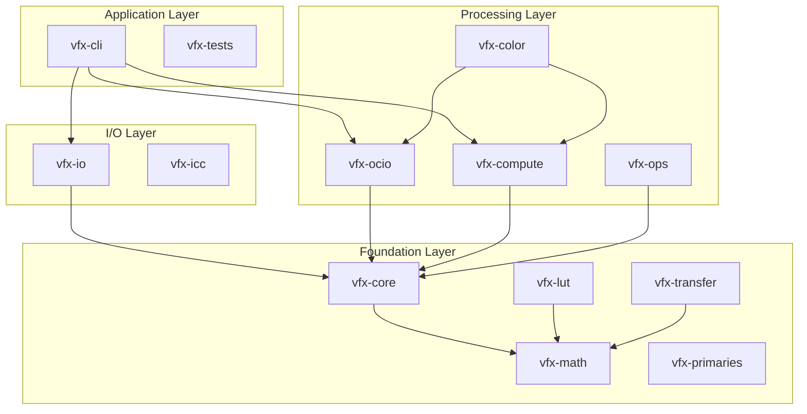
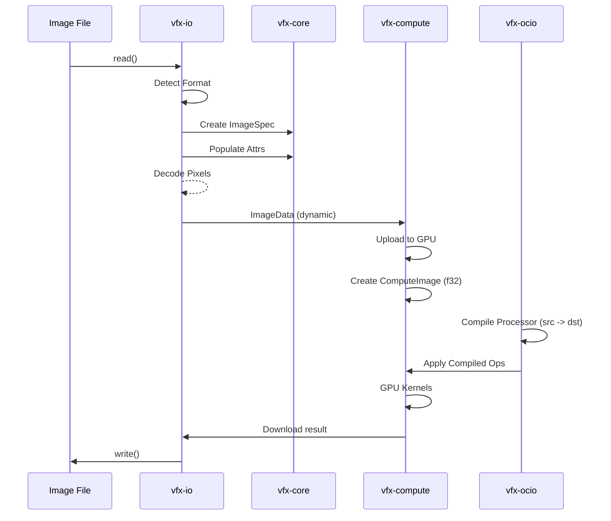

# VFX-RS Architecture & Dataflows

This document describes the internal architecture, dataflows, and codepaths of the `vfx-rs` project.

## Architecture Map

## Dataflow: Image Loading & Processing

The following diagram illustrates how image data flows from a file through the processing pipeline back to disk.

## Codepath: Color Transformation

How a color transform is resolved and executed:

1. **Config Loading**: `vfx_ocio::Config::from_file()` parses YAML into internal structures.
2. **Processor Creation**: `config.processor(src, dst)` builds a chain of `Transform` objects.
3. **Compilation**: `Processor::from_transform()` converts high-level transforms into optimized `Op` variants (Matrix, LUT, CDL, etc.).
4. **Execution**:
    - **CPU Path**: `processor.apply_rgb()` loops over pixels, applying each `Op` sequentially.
    - **GPU Path (Planned)**: `vfx-compute` generates a shader or kernel params from `Op` list and executes on GPU.

## Key Discrepancies & Improvements

- **Ground Truth**: `vfx-core` is being unified to be the single source of truth for metadata (`Attrs`) and image specifications (`ImageSpec`).
- **Processing Backend**: `vfx-compute` is the unified backend for both generic image operations (`vfx-ops`) and color management (`vfx-ocio`).
- **Memory Safety**: Leverages Rust's ownership model to ensure zero-copy views (`ImageView`) across the pipeline while maintaining thread-safety.
