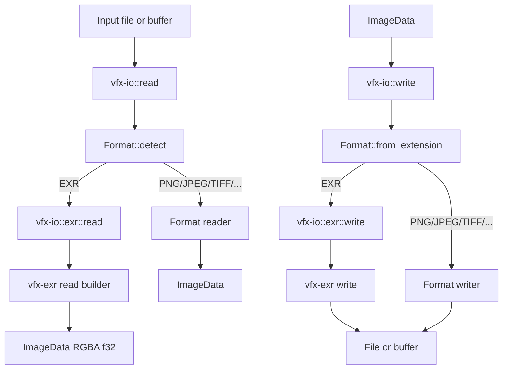
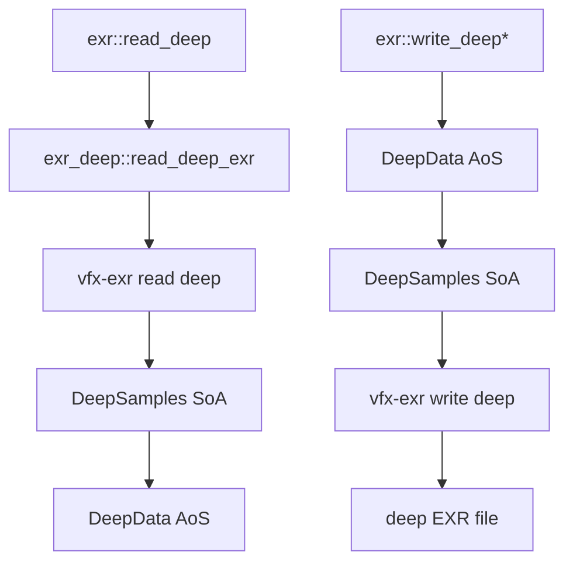

# Diagrams

## vfx-io Read/Write Dataflow

```mermaid
graph TD
    A[Input file or buffer] --> B[vfx-io::read]
    B --> C[Format::detect]
    C -->|EXR| D[vfx-io::exr::read]
    C -->|PNG/JPEG/TIFF/...| E[Format reader]
    D --> F[vfx-exr read builder]
    F --> G[ImageData RGBA f32]
    E --> H[ImageData]

    I[ImageData] --> J[vfx-io::write]
    J --> K[Format::from_extension]
    K -->|EXR| L[vfx-io::exr::write]
    K -->|PNG/JPEG/TIFF/...| M[Format writer]
    L --> N[vfx-exr write]
    N --> O[File or buffer]
    M --> O
```

## Deep EXR Codepath

```mermaid
graph TD
    A[exr::read_deep] --> B[exr_deep::read_deep_exr]
    B --> C[vfx-exr read deep]
    C --> D[DeepSamples SoA]
    D --> E[DeepData AoS]

    F[exr::write_deep*] --> G[DeepData AoS]
    G --> H[DeepSamples SoA]
    H --> I[vfx-exr write deep]
    I --> J[deep EXR file]
```
