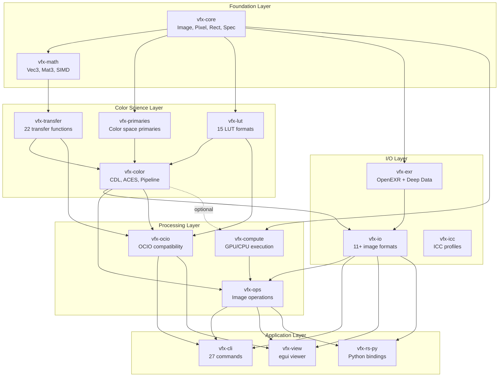

# VFX-RS Architecture Diagrams

**Generated:** 2026-01-13
**Purpose:** Visual documentation of codebase architecture, dataflows, and dependencies

---

## 1. Crate Dependency Graph



---

## 2. CLI Command Processing Flow

```
┌─────────────────────────────────────────────────────────────────────┐
│                        vfx-cli Entry Point                          │
│                         main.rs (clap parsing)                      │
└─────────────────────────────┬───────────────────────────────────────┘
                              │
                              ▼
┌─────────────────────────────────────────────────────────────────────┐
│                      Command Dispatch                               │
│  ┌─────────┬─────────┬─────────┬─────────┬─────────┬─────────────┐ │
│  │  info   │ convert │  resize │composite│  color  │    aces     │ │
│  │ layers  │  batch  │  crop   │  blur   │  grade  │    lut      │ │
│  │  diff   │ maketx  │ rotate  │ sharpen │ premult │   view      │ │
│  └────┬────┴────┬────┴────┬────┴────┬────┴────┬────┴──────┬──────┘ │
└───────┼─────────┼─────────┼─────────┼─────────┼───────────┼────────┘
        │         │         │         │         │           │
        ▼         ▼         ▼         ▼         ▼           ▼
┌─────────────────────────────────────────────────────────────────────┐
│                        vfx-io Read                                  │
│  ┌──────────────────────────────────────────────────────────────┐  │
│  │ Format Detection (magic bytes → extension → heuristics)      │  │
│  └──────────────────────────────────────────────────────────────┘  │
│  ┌─────┬─────┬─────┬─────┬─────┬─────┬─────┬─────┬─────┬─────┐    │
│  │ EXR │ PNG │ JPG │ TIFF│ DPX │ HDR │WebP │ HEIF│ PSD │ DDS │    │
│  └──┬──┴──┬──┴──┬──┴──┬──┴──┬──┴──┬──┴──┬──┴──┬──┴──┬──┴──┬──┘    │
│     └─────┴─────┴─────┴─────┴─────┴─────┴─────┴─────┴─────┘        │
│                              ▼                                      │
│                    ImageData / ImageBuf                             │
└─────────────────────────────┬───────────────────────────────────────┘
                              │
                              ▼
┌─────────────────────────────────────────────────────────────────────┐
│                     Processing Pipeline                             │
│  ┌────────────────────────────────────────────────────────────────┐│
│  │ vfx-ops (Image Operations)                                     ││
│  │  ├─ resize (Lanczos, Mitchell, Bilinear, Box)                 ││
│  │  ├─ composite (Over, Add, Multiply, Screen, Overlay...)       ││
│  │  ├─ filter (Gaussian, Median, Sobel, Morphology)              ││
│  │  ├─ transform (Rotate, Flip, Crop, Pad, Warp)                 ││
│  │  └─ grading (Primary, Tone, RGBCurve, HueCurve)               ││
│  └────────────────────────────────────────────────────────────────┘│
│  ┌────────────────────────────────────────────────────────────────┐│
│  │ vfx-color (Color Transforms)                                   ││
│  │  ├─ CDL (Slope, Offset, Power, Saturation)                    ││
│  │  ├─ ACES (RRT, ODT, IDT, LMT)                                 ││
│  │  ├─ Transfer (sRGB, PQ, HLG, LogC, S-Log...)                  ││
│  │  └─ Matrix (Primaries conversion, Chromatic adaptation)       ││
│  └────────────────────────────────────────────────────────────────┘│
│  ┌────────────────────────────────────────────────────────────────┐│
│  │ vfx-ocio (OpenColorIO Compatibility)                           ││
│  │  ├─ Config parsing (YAML)                                      ││
│  │  ├─ Processor building                                         ││
│  │  └─ Transform chain execution                                  ││
│  └────────────────────────────────────────────────────────────────┘│
└─────────────────────────────┬───────────────────────────────────────┘
                              │
                              ▼
┌─────────────────────────────────────────────────────────────────────┐
│                      vfx-compute Dispatch                           │
│  ┌──────────────────────────────────────────────────────────────┐  │
│  │           Backend Selection (Auto Priority)                   │  │
│  │  ┌────────┐    ┌────────┐    ┌────────┐    ┌────────┐       │  │
│  │  │  CUDA  │ >> │  wgpu  │ >> │  wgpu  │ >> │  CPU   │       │  │
│  │  │ NVIDIA │    │discrete│    │ integr │    │ rayon  │       │  │
│  │  └────────┘    └────────┘    └────────┘    └────────┘       │  │
│  └──────────────────────────────────────────────────────────────┘  │
│                              ▼                                      │
│  ┌──────────────────────────────────────────────────────────────┐  │
│  │                 Automatic Tiling                              │  │
│  │  (VRAM detection → tile size calculation → stitch results)   │  │
│  └──────────────────────────────────────────────────────────────┘  │
└─────────────────────────────┬───────────────────────────────────────┘
                              │
                              ▼
┌─────────────────────────────────────────────────────────────────────┐
│                        vfx-io Write                                 │
│  ┌──────────────────────────────────────────────────────────────┐  │
│  │ Format dispatch (by extension or explicit format)             │  │
│  └──────────────────────────────────────────────────────────────┘  │
│  ┌─────┬─────┬─────┬─────┬─────┬─────┬─────┬─────┐                 │
│  │ EXR │ PNG │ JPG │ TIFF│ DPX │ HDR │WebP │ DDS │                 │
│  └─────┴─────┴─────┴─────┴─────┴─────┴─────┴─────┘                 │
└─────────────────────────────────────────────────────────────────────┘
```

---

## 3. OCIO Processor Build & Apply

```
┌─────────────────────────────────────────────────────────────────────┐
│                    OCIO Config Loading                              │
│                     config.rs::Config                               │
└─────────────────────────────┬───────────────────────────────────────┘
                              │
                              ▼
┌─────────────────────────────────────────────────────────────────────┐
│                Config::processor(src, dst)                          │
│  ┌──────────────────────────────────────────────────────────────┐  │
│  │ ColorSpace Resolution                                         │  │
│  │  src_cs = config.colorspace_by_name(src)                     │  │
│  │  dst_cs = config.colorspace_by_name(dst)                     │  │
│  └──────────────────────────────────────────────────────────────┘  │
└─────────────────────────────┬───────────────────────────────────────┘
                              │
                              ▼
┌─────────────────────────────────────────────────────────────────────┐
│                  Transform Chain Building                           │
│  ┌──────────────────────────────────────────────────────────────┐  │
│  │ src_cs.to_reference_transform()                               │  │
│  │      ↓                                                        │  │
│  │ [Optional: reference space interchange]                       │  │
│  │      ↓                                                        │  │
│  │ dst_cs.from_reference_transform()                             │  │
│  └──────────────────────────────────────────────────────────────┘  │
└─────────────────────────────┬───────────────────────────────────────┘
                              │
                              ▼
┌─────────────────────────────────────────────────────────────────────┐
│            Processor::from_transform(chain)                         │
│  ┌──────────────────────────────────────────────────────────────┐  │
│  │ compile_transform() - Flatten GroupTransform                  │  │
│  │      ↓                                                        │  │
│  │ ProcessorOp List:                                             │  │
│  │  ┌────────┬────────┬────────┬────────┬────────┬────────────┐ │  │
│  │  │ Matrix │ Range  │ LUT1D  │ LUT3D  │Transfer│    CDL     │ │  │
│  │  │ 3x4    │ clamp  │ linear │ tri/tet│ encode │slope/off/pw│ │  │
│  │  └────────┴────────┴────────┴────────┴────────┴────────────┘ │  │
│  │  ┌────────┬────────┬────────┬────────┬────────┬────────────┐ │  │
│  │  │ Fixed  │Exponent│Exposure│Grading │Grading │  Grading   │ │  │
│  │  │Function│  pow   │Contrast│Primary │  Tone  │  RGBCurve  │ │  │
│  │  └────────┴────────┴────────┴────────┴────────┴────────────┘ │  │
│  └──────────────────────────────────────────────────────────────┘  │
└─────────────────────────────┬───────────────────────────────────────┘
                              │
                              ▼
┌─────────────────────────────────────────────────────────────────────┐
│                 processor.apply(&mut pixels)                        │
│  ┌──────────────────────────────────────────────────────────────┐  │
│  │ For each ProcessorOp:                                         │  │
│  │   match op {                                                  │  │
│  │     Matrix => apply_matrix_3x4(pixels, matrix),              │  │
│  │     Range => apply_range(pixels, min_in, max_in, ...),       │  │
│  │     LUT3D => apply_lut3d_tetrahedral(pixels, lut, size),     │  │
│  │     Transfer => apply_transfer_fn(pixels, fn_type, dir),     │  │
│  │     CDL => apply_cdl(pixels, slope, offset, power, sat),     │  │
│  │     ...                                                       │  │
│  │   }                                                           │  │
│  └──────────────────────────────────────────────────────────────┘  │
└─────────────────────────────────────────────────────────────────────┘
```

---

## 4. Deep EXR Read Path

```
┌─────────────────────────────────────────────────────────────────────┐
│                    vfx_io::exr_deep::read()                         │
└─────────────────────────────┬───────────────────────────────────────┘
                              │
                              ▼
┌─────────────────────────────────────────────────────────────────────┐
│                vfx_exr::image::read::ReadImage                      │
│  ┌──────────────────────────────────────────────────────────────┐  │
│  │ 1. Read magic number (0x76, 0x2f, 0x31, 0x01)                │  │
│  │ 2. Read version flags (deep data indicator)                   │  │
│  └──────────────────────────────────────────────────────────────┘  │
└─────────────────────────────┬───────────────────────────────────────┘
                              │
                              ▼
┌─────────────────────────────────────────────────────────────────────┐
│                   meta::read_headers()                              │
│  ┌──────────────────────────────────────────────────────────────┐  │
│  │ Parse attributes:                                             │  │
│  │  - channels (name, type, sampling)                           │  │
│  │  - dataWindow, displayWindow                                  │  │
│  │  - compression                                                │  │
│  │  - deepDataVersion (for deep images)                         │  │
│  │  - maxSamplesPerPixel                                        │  │
│  └──────────────────────────────────────────────────────────────┘  │
└─────────────────────────────┬───────────────────────────────────────┘
                              │
                              ▼
┌─────────────────────────────────────────────────────────────────────┐
│               block::reader::ChunksReader                           │
│  ┌──────────────────────────────────────────────────────────────┐  │
│  │ Read offset table → iterate chunks                            │  │
│  └──────────────────────────────────────────────────────────────┘  │
│                              ▼                                      │
│  ┌──────────────────────────────────────────────────────────────┐  │
│  │ For each deep scanline/tile:                                  │  │
│  │  1. Read sample count table (cumulative counts)               │  │
│  │  2. Read compressed sample data                               │  │
│  │  3. Decompress (ZIP/ZIPS/RLE/None)                           │  │
│  └──────────────────────────────────────────────────────────────┘  │
└─────────────────────────────┬───────────────────────────────────────┘
                              │
                              ▼
┌─────────────────────────────────────────────────────────────────────┐
│           compression::decompress_deep_scanline()                   │
│  ┌──────────────────────────────────────────────────────────────┐  │
│  │ Compression Support for Deep Data:                            │  │
│  │  ✓ Uncompressed (None)                                       │  │
│  │  ✓ RLE (Run Length Encoding)                                 │  │
│  │  ✓ ZIP1 (Single scanline ZLIB)                               │  │
│  │  ✗ ZIP16, PIZ, PXR24, B44, DWA - Not supported for deep     │  │
│  └──────────────────────────────────────────────────────────────┘  │
└─────────────────────────────┬───────────────────────────────────────┘
                              │
                              ▼
┌─────────────────────────────────────────────────────────────────────┐
│                block::deep::DeepSamples                             │
│  ┌──────────────────────────────────────────────────────────────┐  │
│  │ Structure (Struct-of-Arrays for cache efficiency):            │  │
│  │                                                               │  │
│  │  sample_counts: [u32; width*height]  // cumulative prefix    │  │
│  │  channel_data: Vec<DeepChannelData>                           │  │
│  │    └─ F16(Vec<f16>) | F32(Vec<f32>) | U32(Vec<u32>)          │  │
│  │                                                               │  │
│  │ Access pattern:                                               │  │
│  │  pixel(x,y) → start = counts[y*w+x-1], end = counts[y*w+x]   │  │
│  │  samples = channel_data[start..end]                          │  │
│  └──────────────────────────────────────────────────────────────┘  │
└─────────────────────────────────────────────────────────────────────┘
```

---

## 5. Viewer Runtime Loop (vfx-view)

```
┌─────────────────────────────────────────────────────────────────────┐
│                     ViewerApp (egui)                                │
│                        app.rs                                       │
└──────────────────────────────┬──────────────────────────────────────┘
                               │
           ┌───────────────────┼───────────────────┐
           │                   │                   │
           ▼                   ▼                   ▼
┌──────────────────┐ ┌──────────────────┐ ┌──────────────────┐
│   UI Thread      │ │  Message Chan    │ │  Worker Thread   │
│   (egui/eframe)  │ │  (mpsc channel)  │ │  (ViewerHandler) │
└────────┬─────────┘ └────────┬─────────┘ └────────┬─────────┘
         │                    │                    │
         │                    │                    │
         ▼                    │                    ▼
┌──────────────────┐          │         ┌──────────────────┐
│ User Actions:    │          │         │ Background Tasks:│
│ • Open file      │ ────────►│◄─────── │ • Load image     │
│ • Change layer   │          │         │ • Apply color    │
│ • Adjust exposure│          │         │ • Generate mips  │
│ • Pan/zoom       │          │         │                  │
│ • Channel select │          │         │                  │
└────────┬─────────┘          │         └────────┬─────────┘
         │                    │                  │
         ▼                    │                  ▼
┌──────────────────────────────────────────────────────────┐
│                  Message Types                           │
│  ┌──────────────────────────────────────────────────┐   │
│  │ ToHandler:                                        │   │
│  │   LoadImage(path) | SetLayer(idx) |              │   │
│  │   SetChannel(mode) | SetExposure(f32) |          │   │
│  │   SetOcioConfig(path) | SetDisplay(name) |       │   │
│  │   SetView(name) | RequestPixel(x,y)              │   │
│  └──────────────────────────────────────────────────┘   │
│  ┌──────────────────────────────────────────────────┐   │
│  │ FromHandler:                                      │   │
│  │   ImageLoaded(layers) | LayerChanged(data) |     │   │
│  │   ColorTransformed(rgba_data) |                  │   │
│  │   PixelValue(x,y,rgba) | Error(msg)             │   │
│  └──────────────────────────────────────────────────┘   │
└────────────────────────────┬─────────────────────────────┘
                             │
                             ▼
┌─────────────────────────────────────────────────────────────────────┐
│                   Color Pipeline Application                        │
│  ┌──────────────────────────────────────────────────────────────┐  │
│  │ 1. Load raw pixels (f32 linear)                               │  │
│  │ 2. Apply channel mode:                                        │  │
│  │    • Color → [R, G, B, A]                                    │  │
│  │    • Red/Green/Blue → [X, X, X, 1]                           │  │
│  │    • Alpha → [A, A, A, 1]                                    │  │
│  │    • Luminance → [L, L, L, 1] where L=0.2126R+0.7152G+0.0722B│  │
│  │ 3. Apply exposure: pixel *= 2^exposure                       │  │
│  │ 4. Apply OCIO display transform (if configured)              │  │
│  │ 5. Convert to sRGB for display                               │  │
│  │ 6. Upload to GPU texture                                     │  │
│  └──────────────────────────────────────────────────────────────┘  │
└─────────────────────────────────────────────────────────────────────┘
```

---

## 6. Code Duplication Map

```
┌─────────────────────────────────────────────────────────────────────┐
│                    CDL Struct Duplication                           │
│                                                                     │
│  ┌─────────────────┐   ┌─────────────────┐   ┌─────────────────┐   │
│  │  vfx-color      │   │  vfx-compute    │   │   vfx-lut       │   │
│  │  cdl.rs:76      │   │  color.rs:44    │   │  clf.rs:80      │   │
│  │  struct Cdl     │   │  struct Cdl     │   │  struct CdlParams│  │
│  │  {slope,offset, │   │  {slope,offset, │   │  {slope,offset, │   │
│  │   power,sat,    │   │   power,sat}    │   │   power,sat,    │   │
│  │   clamp_*,rev}  │   │                 │   │   clamp_*}      │   │
│  └────────┬────────┘   └────────┬────────┘   └────────┬────────┘   │
│           │                     │                     │             │
│           └─────────────────────┼─────────────────────┘             │
│                                 ▼                                   │
│                    RECOMMENDATION:                                  │
│                    Use vfx_color::Cdl everywhere                   │
└─────────────────────────────────────────────────────────────────────┘

┌─────────────────────────────────────────────────────────────────────┐
│                  Rec.709 Luma Constants Duplication                 │
│                                                                     │
│  Found in 15+ locations:                                            │
│  • vfx-color/cdl.rs (203, 247)                                     │
│  • vfx-color/aces2/* (multiple)                                    │
│  • vfx-view/handler.rs (31-32)                                     │
│  • vfx-cli/commands/color.rs (86)                                  │
│  • vfx-cli/commands/grade.rs (92)                                  │
│  • vfx-compute/shaders/mod.rs (68)                                 │
│  • vfx-compute/backend/cpu_backend.rs (122)                        │
│  • vfx-compute/backend/cuda_backend.rs (86)                        │
│  • vfx-core/pixel.rs (409)                                         │
│  • vfx-ops/grading_primary.rs (19-20)                              │
│  • vfx-ops/fixed_function.rs (1468-1469)                           │
│  • vfx-io/imagebufalgo/color.rs (multiple)                         │
│  • vfx-ocio/processor.rs (multiple)                                │
│  • vfx-lut/cdl.rs (95)                                             │
│  • vfx-lut/clf.rs (138)                                            │
│                                                                     │
│  RECOMMENDATION:                                                    │
│  Add to vfx-core or vfx-primaries:                                 │
│    pub const REC709_LUMA: [f32; 3] = [0.2126, 0.7152, 0.0722];    │
│    pub fn luminance(rgb: [f32; 3]) -> f32;                         │
└─────────────────────────────────────────────────────────────────────┘

┌─────────────────────────────────────────────────────────────────────┐
│               sRGB to XYZ Matrix Duplication                        │
│                                                                     │
│  Defined in:                                                        │
│  • vfx-primaries/lib.rs:481 - SRGB_TO_XYZ (canonical)              │
│  • vfx-ocio/builtin_transforms.rs:89 - SRGB_TO_XYZ_D65             │
│  • vfx-color/aces2/transform.rs:307 - srgb_to_xyz_matrix()         │
│  • vfx-color/aces2/cam.rs:354 - srgb_to_xyz() (test helper)        │
│  • vfx-color/aces2/tonescale.rs:170 - srgb_to_xyz() (test)         │
│  • vfx-color/aces2/tables.rs:347 - srgb_to_xyz() (test)            │
│                                                                     │
│  RECOMMENDATION:                                                    │
│  Use vfx_primaries::SRGB_TO_XYZ everywhere                         │
│  Remove duplicate definitions                                       │
└─────────────────────────────────────────────────────────────────────┘
```

---

## 7. Memory Architecture

```
┌─────────────────────────────────────────────────────────────────────┐
│                    vfx-core Memory Model                            │
│  ┌──────────────────────────────────────────────────────────────┐  │
│  │ Image<CS, T> {                                                │  │
│  │   data: Arc<Vec<T>>,  // Shared ownership, zero-copy clone   │  │
│  │   width: u32,                                                 │  │
│  │   height: u32,                                                │  │
│  │   channels: usize,                                            │  │
│  │   _cs: PhantomData<CS>,  // Compile-time color space         │  │
│  │ }                                                             │  │
│  └──────────────────────────────────────────────────────────────┘  │
└─────────────────────────────────────────────────────────────────────┘
                              │
                              ▼ MISMATCH
┌─────────────────────────────────────────────────────────────────────┐
│                   vfx-compute Memory Model                          │
│  ┌──────────────────────────────────────────────────────────────┐  │
│  │ ComputeImage {                                                │  │
│  │   data: Vec<f32>,    // OWNED - forces copy on clone         │  │
│  │   width: u32,                                                 │  │
│  │   height: u32,                                                │  │
│  │   channels: u32,                                              │  │
│  │ }                                                             │  │
│  └──────────────────────────────────────────────────────────────┘  │
│                                                                     │
│  ISSUE: Every ComputeImage::from(&Image) copies entire buffer      │
│  FIX: Change to Arc<Vec<f32>> or Arc<[f32]>                        │
└─────────────────────────────────────────────────────────────────────┘
```

---

## 8. Test Coverage Map

```
┌─────────────────────────────────────────────────────────────────────┐
│                    Test Infrastructure                              │
│                                                                     │
│  tests/                                                             │
│  ├─ parity/                    # Python OCIO comparison tests      │
│  │  ├─ conftest.py            # PyTest setup                       │
│  │  ├─ test_transfer_parity.py # 22 transfer functions            │
│  │  ├─ test_matrix_parity.py   # Matrix transforms                │
│  │  ├─ test_lut_parity.py      # LUT operations                   │
│  │  ├─ test_ops_parity.py      # CDL, grading ops                 │
│  │  └─ test_processor_parity.py # Full processor chains           │
│  │                                                                  │
│  ├─ golden/                    # Hash-based golden tests           │
│  │  ├─ hashes.json            # Reference hashes                   │
│  │  └─ reference_images/       # Reference outputs                 │
│  │                                                                  │
│  └─ debug/                     # Debug/verification scripts        │
│     ├─ verify_cdl_final.py                                         │
│     ├─ compare_cdl.py                                              │
│     └─ verify_fast_pow.py                                          │
│                                                                     │
│  crates/vfx-tests/             # Rust integration tests            │
│  └─ src/golden.rs              # Golden test framework             │
└─────────────────────────────────────────────────────────────────────┘

┌─────────────────────────────────────────────────────────────────────┐
│                    Coverage by Crate                                │
│                                                                     │
│  Crate          │ Unit Tests │ Integration │ Parity │ Status       │
│  ───────────────┼────────────┼─────────────┼────────┼───────────── │
│  vfx-core       │    ✓       │     -       │   -    │ Good         │
│  vfx-math       │    ✓       │     -       │   -    │ Good         │
│  vfx-transfer   │    ✓       │     ✓       │   ✓    │ Excellent    │
│  vfx-primaries  │    ✓       │     ✓       │   ✓    │ Excellent    │
│  vfx-lut        │    ✓       │     ✓       │   ✓    │ Good         │
│  vfx-color      │    ✓       │     ✓       │   ✓    │ Excellent    │
│  vfx-exr        │    ✓       │     ✓       │   -    │ Good         │
│  vfx-io         │    ✓       │     ✓       │   -    │ Good         │
│  vfx-ops        │    ✓ (252) │     ✓       │   ✓    │ Excellent    │
│  vfx-ocio       │    ✓       │     ✓       │   ✓    │ Excellent    │
│  vfx-compute    │    ✓       │     ✓       │   -    │ Fair         │
│  vfx-cli        │    ~       │     -       │   -    │ Limited      │
│  vfx-view       │    -       │     -       │   -    │ Manual only  │
└─────────────────────────────────────────────────────────────────────┘
```
